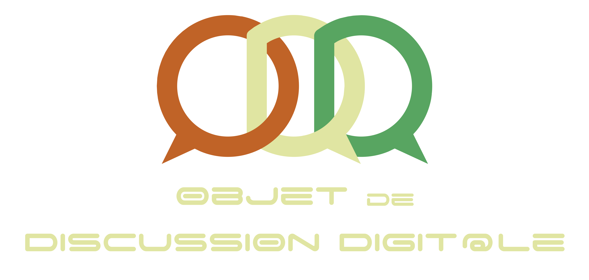

 

  

  

    Java Chat System
     
    <a href="https://github.com/Enjmateo/distributed_chat_system/releases"><strong>See releases »</strong></a>
     
     
    <a href="uml/">Project design (UML)</a>
    ·
    <a href="https://github.com/Enjmateo/distributed_chat_system/">See project</a>
  

## About the projet
Project carried out as part of the 4th year in computer science and networks at INSA Toulouse. Complete, distributed and powerful, *Objet de Discussion Digital* (english: Digital Discussion Object) is the new standard in the world of messaging apps.

## Development methods
We use the agile method to carry out this project, more on this to come. UML design is under the `uml/` folder.

