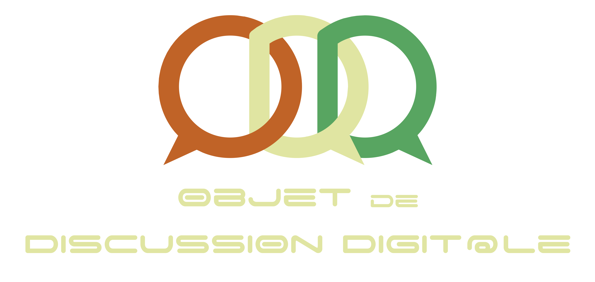

 

  

  

    Java Chat System
     
    <a href="https://github.com/Enjmateo/distributed_chat_system/releases"><strong>Voir les releases »</strong></a>
     
     
    <a href="documentation.md">Documentation</a>
    .
    <a href="rapport.pdf/">Rapport</a>
    ·
    <a href="https://github.com/Enjmateo/distributed_chat_system/">Projet</a>
  

## À propos du projet
**Objet de Discussion Digitale** est un logiciel de communication partiellement décentralisé conçu et implémenté dans le cadre de quatrième année Informatique et Réseaux à l'INSA Toulouse. Il inclut des fonctionnalités d'envoi de messages, d'envoi de fichier et de découverte des utilisateurs.

## Le projet & UML
Voir [le rapport](rapport.pdf).

## Contact
[Manah](https://manah.fr), [Enjmateo](https://github.com/Enjmateo).

